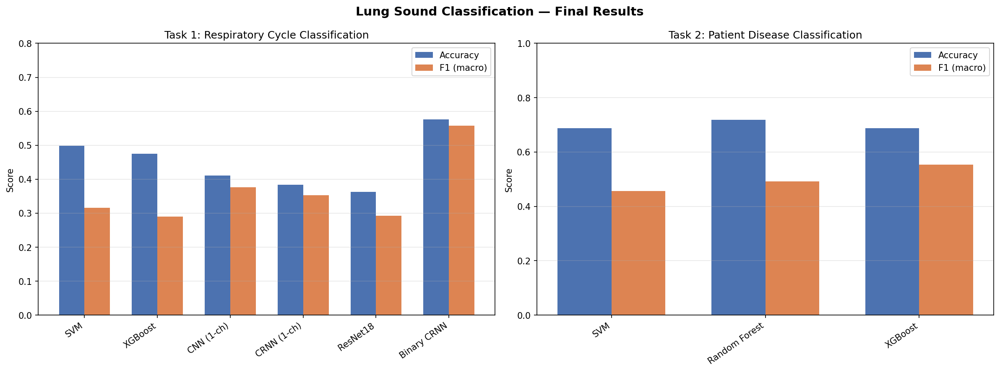
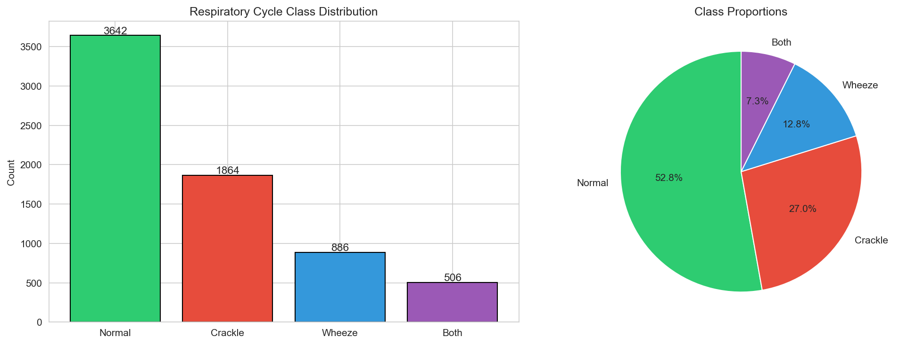
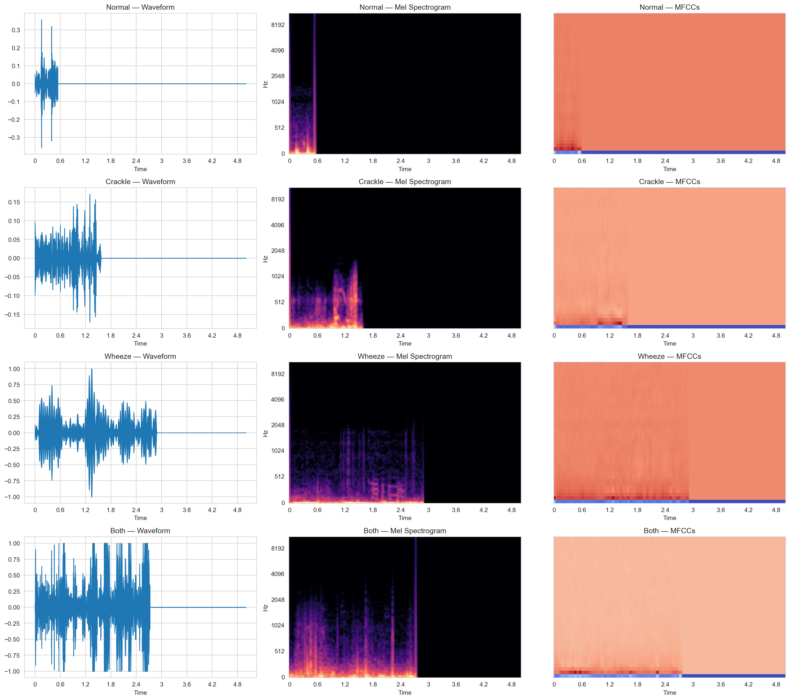
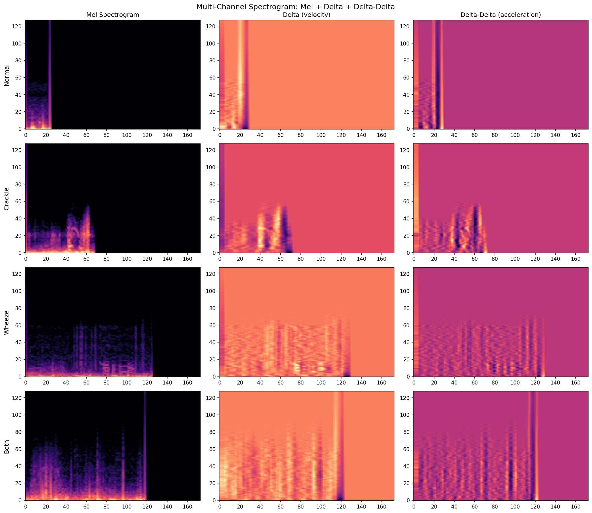

# Sound-Based Lung Disease Detection

Automated respiratory sound classification using machine learning and deep learning on the [ICBHI 2017 Respiratory Sound Database](https://www.kaggle.com/datasets/vbookshelf/respiratory-sound-database). This project classifies respiratory cycles into Normal, Crackle, Wheeze, and Both categories, and performs patient-level disease diagnosis across COPD, Healthy, Chronic, and Infectious groups.



## Project Overview

Respiratory diseases are the third leading cause of death globally. Lung auscultation — listening to breathing sounds with a stethoscope — is a primary diagnostic tool, but accurate interpretation requires significant clinical expertise and is inherently subjective. This project explores whether machine learning can automate the classification of respiratory sounds to support scalable, accessible diagnostics.

### Key Contributions

- **Rigorous evaluation methodology**: Patient-aware data splitting ensures no patient appears in multiple splits, preventing data leakage that inflates reported accuracy in many published works
- **Comprehensive model comparison**: Six architectures evaluated across traditional ML (SVM, Random Forest, XGBoost) and deep learning (CNN, CRNN with attention, ResNet18 transfer learning)
- **Multi-level classification**: Both cycle-level sound classification (4-class and binary) and patient-level disease diagnosis
- **Critical analysis of published results**: Contextualises findings within the broader literature, identifying sources of bias in reported 95–99% accuracies

## Dataset

The ICBHI 2017 Respiratory Sound Database contains:

| Attribute | Value |
|---|---|
| Patients | 126 (children to elderly) |
| Recordings | 920 annotated audio files |
| Respiratory cycles | 6,898 |
| Total duration | 5.5 hours |
| Recording devices | 4 (AKG microphone, 2× Littmann, Meditron) |
| Chest locations | 7 (trachea, anterior/posterior/lateral L/R) |
| Diagnoses | 8 (COPD, Healthy, URTI, Bronchiectasis, Pneumonia, Bronchiolitis, LRTI, Asthma) |

### Class Distribution

| Cycle Class | Count | Proportion |
|---|---|---|
| Normal | 3,642 | 52.8% |
| Crackle | 1,864 | 27.0% |
| Wheeze | 886 | 12.8% |
| Both | 506 | 7.3% |



## Methodology

### Data Pipeline

```
Raw Audio (.wav) → Annotation Parsing → Cycle Segmentation → Pad/Truncate (4s)
     ↓                                                              ↓
Patient-Aware Split (Train 65% / Val 15% / Test 20%)          Feature Extraction
     ↓                                                              ↓
     ├── Handcrafted Features (264-dim) ──→ ML Models      ├── Mel Spectrogram
     │   (MFCCs, Chroma, Spectral, ZCR)    (SVM, RF, XGB)  │   (128 bins × T)
     │                                                      ├── Delta (1st deriv.)
     └── 3-Channel Spectrogram ───────────→ DL Models       └── Delta-Delta (2nd)
         (Mel + Delta + Delta²)             (CNN, CRNN,         ↓
                                             ResNet18)      Normalisation (μ=0, σ=1)
```

### Patient-Aware Splitting

The most critical design decision in this project. Respiratory cycles from the same patient share acoustic characteristics (vocal tract, breathing pattern, recording conditions). Randomly splitting cycles allows the model to memorise patient-specific features rather than learning generalisable respiratory sound patterns.

We ensure **zero patient overlap** between train, validation, and test sets using `GroupShuffleSplit` with patient ID as the grouping variable.

### Models Evaluated

**Traditional ML** (on 264-dimensional handcrafted features):
- SVM with RBF kernel
- Random Forest (300 trees)
- XGBoost (300 estimators)
- Gradient Boosting (200 estimators)

**Deep Learning** (on mel spectrograms):
- Custom CNN with batch normalisation and SpecAugment
- CRNN: CNN + Bidirectional GRU with attention pooling
- ResNet18 transfer learning (pre-trained on ImageNet)

**Training techniques**: Focal loss, class weighting (sqrt inverse frequency), cosine annealing, mixup augmentation, audio-level augmentation (noise injection, time shift, pitch perturbation, volume scaling), gradient clipping, early stopping.

## Results

### Task 1: Respiratory Cycle Classification (4-Class)

| Model | Accuracy | F1 (macro) | ICBHI Score |
|---|---|---|---|
| **SVM (RBF)** | **0.499** | 0.316 | 0.473 |
| XGBoost | 0.475 | 0.290 | — |
| CNN (1-channel) | 0.411 | **0.376** | — |
| CRNN (1-channel) | 0.384 | 0.353 | — |
| ResNet18 Transfer | 0.363 | 0.293 | — |

### Task 1: Binary Classification (Normal vs Abnormal)

| Model | Accuracy | F1 (macro) | ICBHI Score |
|---|---|---|---|
| **ResNet18 Transfer** | **0.576** | **0.558** | — |
| SVM (binary) | 0.561 | 0.549 | **0.611** |

### Task 2: Patient-Level Disease Classification

| Model | Accuracy | F1 (macro) |
|---|---|---|
| **Random Forest** | **0.719** | 0.492 |
| **XGBoost** | 0.688 | **0.554** |
| SVM | 0.688 | 0.457 |

### Context: Understanding Published Results

Published accuracies on the ICBHI dataset range from 49% to 99%+. This variation stems primarily from evaluation methodology:

| Evaluation Method | Typical Accuracy | Validity |
|---|---|---|
| Random cycle split (data leakage) | 85–99% |  Same patient in train + test |
| 5-fold CV without patient grouping | 80–95% |  Same patient across folds |
| Official ICBHI split (60/40) | 55–72% |  Patient-aware |
| Custom patient-aware split (this project) | 50–58% |  Patient-aware, stricter |

The current state-of-the-art with proper patient-aware evaluation achieves **64.84% ICBHI Score** for 4-class using BEATs (a 90M parameter transformer pre-trained on AudioSet). Our SVM achieves **61.1% ICBHI Score** for binary classification with a fraction of the model complexity.

Studies reporting 95–99% accuracy typically suffer from one or more issues: patient data leakage between splits, heavy reliance on demographic features (age/sex predict COPD independently of audio), small/fixed test sets that are inadvertently optimised against, or simplified binary classification tasks.

## Audio Visualisation





## Project Structure

```
lung-sound-classification/
├── src/
│   ├── config.py                  # Paths, hyperparameters, constants
│   ├── data_loader.py             # Annotation parsing, patient-aware splitting
│   ├── feature_extraction.py      # Handcrafted features & mel spectrograms
│   ├── models.py                  # CNN, CRNN, ML model factory
│   └── evaluate.py                # Metrics, training loop, visualisation
├── notebooks/
│   ├── 01_eda.ipynb               # Exploratory data analysis
│   ├── 02_feature_extraction_and_ml.ipynb   # Feature extraction & ML baselines
│   ├── 03_deep_learning.ipynb     # CNN & CRNN (initial)
│   ├── 04_improved_deep_learning.ipynb  # Normalisation & augmentation fixes
│   ├── 05_final_models.ipynb      # Multi-channel, binary, multi-modal
│   ├── 06_transfer_learning.ipynb # ResNet18 & ensemble
│   └── 07_final_evaluation.ipynb  # ICBHI scores & disease classification
├── demo.py                        # End-to-end inference demo
├── outputs/
│   ├── figures/                   # All generated plots
│   └── models/                    # Saved model weights
├── requirements.txt
├── LICENSE
└── README.md
```

## Installation

```bash
git clone https://github.com/pedramebd/lung-sound-classification.git
cd lung-sound-classification
pip install -r requirements.txt
```

### Requirements

- Python 3.10+
- PyTorch 2.0+ (with CUDA for GPU training)
- librosa, scikit-learn, xgboost, imbalanced-learn
- See `requirements.txt` for full list

### Dataset Setup

1. Download the [Respiratory Sound Database](https://www.kaggle.com/datasets/vbookshelf/respiratory-sound-database) from Kaggle
2. Extract to your preferred location
3. Update `DATA_DIR` in `src/config.py` to point to the extracted `Respiratory_Sound_Database` folder

## Quick Start

Run the demo to classify a respiratory sound file:

```bash
python demo.py --audio_path path/to/audio.wav --model svm
```

Or step through the notebooks in order (01 → 07) to reproduce all results.

## Key Takeaways

1. **Patient-aware evaluation is non-negotiable** for medical ML. Without it, results are meaningless for clinical deployment.
2. **Simple models can be competitive**. SVM on handcrafted features outperformed deep learning on raw accuracy for 4-class classification, while deep learning excelled at balanced per-class performance (higher F1 macro).
3. **The 4-class problem is genuinely hard**. With only 126 patients and 4 different recording devices, learning generalisable acoustic features is challenging. The "Both" class (crackle + wheeze simultaneously) is particularly difficult as it overlaps with both individual classes.
4. **Binary classification is clinically actionable**. The screening question "does this patient have abnormal respiratory sounds?" achieves 57.6% accuracy with balanced performance — useful as a triage tool rather than a definitive diagnostic.
5. **Spectrogram normalisation matters more than model architecture**. The single biggest improvement came from per-sample standardisation (zero mean, unit variance), not from switching CNN → CRNN → ResNet18.

## References

1. Rocha, B.M. et al. (2019). "An open access database for the evaluation of respiratory sound classification algorithms." *Physiological Measurement*, 40(3).
2. Ngo, D. et al. (2023). "Machine Learning for Automated Classification of Abnormal Lung Sounds Obtained from Public Databases: A Systematic Review." *Bioengineering*, 10(10), 1155.
3. Byun, S. et al. (2025). "Patient-Aware Feature Alignment for Robust Lung Sound Classification." *arXiv:2505.23834*.
4. Ma, Y. et al. (2025). "Advances and Challenges in Respiratory Sound Analysis: A Technique Review Based on the ICBHI2017 Database." *Electronics*, 14(14), 2794.
5. Petmezas, G. et al. (2022). "Automated Lung Sound Classification Using a Hybrid CNN-LSTM Network and Focal Loss Function." *Sensors*, 22(3), 1232.

##  Author

**Pedram Ebadollahyvahed** — MSc Data Science, Cardiff University (2025–2026)

[GitHub](https://github.com/pedramebd) · [LinkedIn](https://www.linkedin.com/in/pedramebadollahyvahed)

## License

This project is licensed under the MIT License — see the [LICENSE](LICENSE) file for details.
